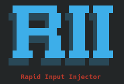

# Rapid Input Injector

---



---

A lightweight, terminal-based automation tool designed for rapid text injection, load testing, and input fuzzing. Built with Python and `pyautogui`, it features a custom TUI (Text User Interface) with gradient aesthetics and zero restriction logic.

---

## Features
- **Multi-Mode Injection:** Support for Static payloads, Dictionary cycling, and Random Fuzzing.
- **Human Jitter:** Randomized delay intervals to simulate human input speeds and bypass anti-bot detection.
- **Visual Interface:** Custom ASCII banner with RGB gradient rendering.
- **Safety Failsafe:** Integrated "Panic Switch" to abort execution instantly.
- **High Performance:** No hard-coded limits on speed or iteration count.

---

## Prerequisites
- Python 3.x
- `pyautogui` library
- X11 or XWayland (if running on Linux)

---

## Installation

1. **Clone the repository**

```bash
git clone https://github.com/GlebGoodkovsky/Rapid-Input-Injector.git
cd rapid-input-injector
```

2. **Make executable**

```bash
chmod +x rii.py
```

---

## Usage

Run the script directly from your terminal:

```bash
./rii.py
```

### Configuration Steps
When launched, the interactive menu will guide you through:

1.  **Mode Selection:**
    *   **Static:** Repeats a single phrase.
    *   **Dictionary:** Cycles through a comma-separated list of words.
    *   **Fuzzer:** Generates random alphanumeric garbage strings (customizable length).
2.  **Count:** Total number of injections to perform.
3.  **Timing (Jitter):** Set a Minimum and Maximum delay (e.g., `0.1s` to `0.5s`). The script will randomize the speed for every message.
4.  **Arming:** Delay in seconds before the script begins typing.

*Once the countdown finishes, the script will execute the payload sequence automatically.*

---

## Emergency Stop (Failsafe)

If the script is running too fast to stop via keyboard:

**Slam your mouse cursor into the TOP-RIGHT corner of the screen.**

This triggers the custom failsafe exception and kills the process instantly.

---

## Disclaimer
This tool is intended for testing input fields, load testing chat applications, and QA automation tasks. The user is responsible for where this script is pointed.

---

### Important Note

This was developed utilizing AI-assisted workflows for rapid prototyping and code optimization, demonstrating modern pair-programming methodologies.

---